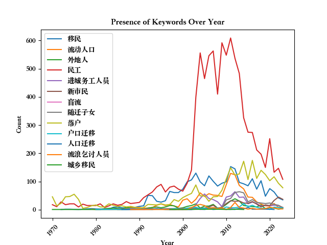
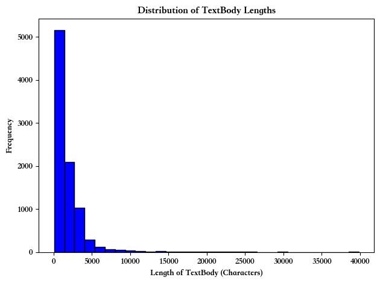
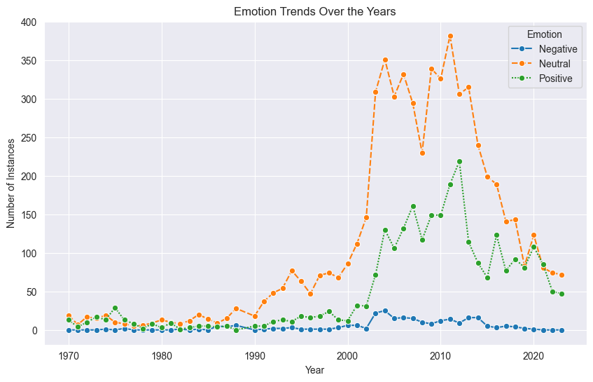
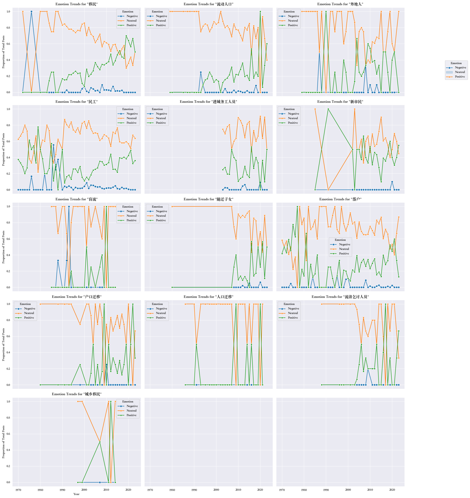
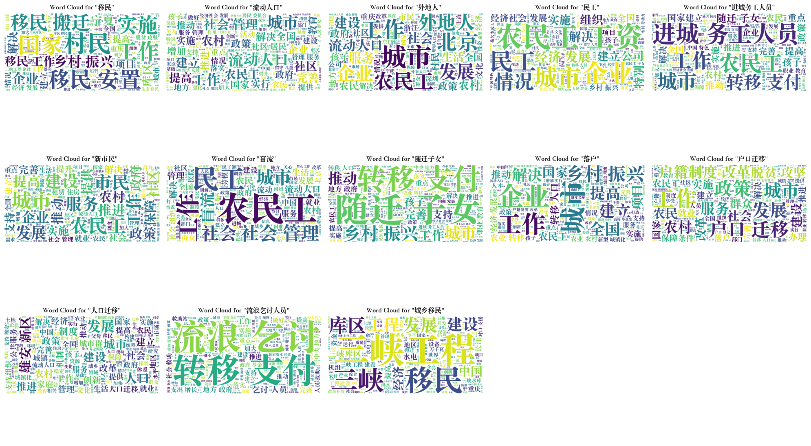
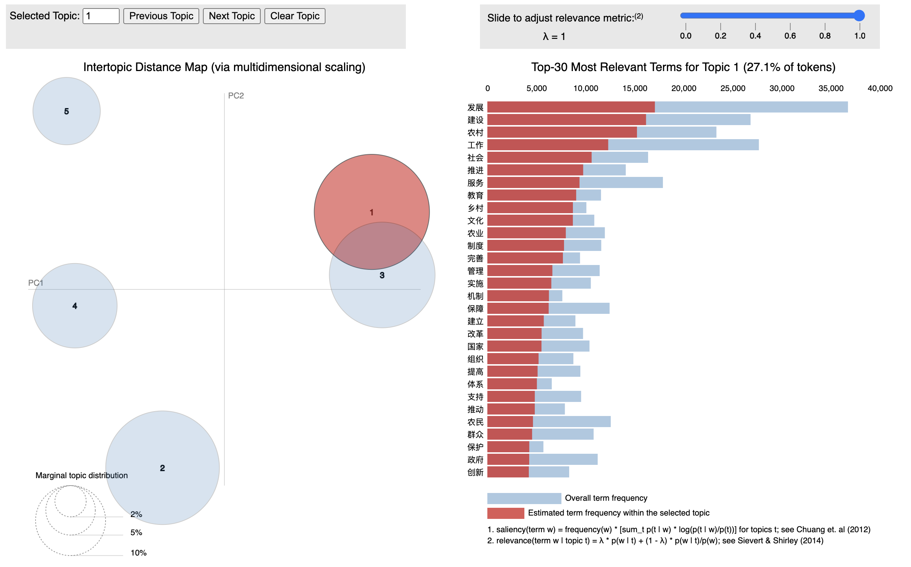

# Attitudes of the Chinese Government Toward Internal Migrants: An Analysis of Evidence from The People's Daily

## Project Overview
This research project delves into the evolving dynamics of internal migration in China, particularly within the constraints of the hukou system—a household registration policy that limits the mobility and rights of Chinese citizens. Despite such restrictions, internal migration has seen a significant uptick due to economic incentives and enforced relocations, like those for large-scale infrastructure developments.

The study focuses on analyzing content from The People's Daily, the official newspaper of the Communist Party of China (CPC), from 1970 to 2023. The primary goal is to decode the topics and sentiments expressed about internal migration, examining how they reflect broader governmental attitudes and policy shifts over the decades.

## Research Objectives
- **Sentiment Analysis:** Utilize a custom-designed model that integrates RoBERTa and BiGRU to effectively process long Chinese Texts, aiming to classify the underlying sentiments in the articles.
- **Topic Modeling:** Apply LDA (Latent Dirichlet Allocation) to identify prevalent themes and track their evolution over time within the dataset.

## Methodology
- **Sentiment Classification:**
The sentiment classification part of the project employs a hybrid model combining the robustness of RoBERTa with the sequence processing capabilities of BiGRU. This model is specifically tuned to handle the complexities of lengthy Chinese texts. To manage the inherent limitations of BERT’s maximum sequence length (512 tokens), we divide text into small chunks. Each segmented chunk is processed through BERT to generate contextual embeddings, capturing the nuanced semantics within that segment. These embeddings are then fed into a BiGRU layer, which processes the data bi-directionally. The model is optimized using the AdamW optimizer, incorporating a warm-up strategy for the learning rate to improve training dynamics and model convergence. Performance is evaluated using standard metrics such as F1-score and accuracy, assessed on a validation set to ensure the model’s efficacy and robustness in real-world applications. The model ended up with an accuracy of 0.847 on the test set

- **Topic Modeling:**
For topic analysis, the LDA model is used to extract and monitor thematic trends, providing insights into the shifts in discourse surrounding internal migrants and related policies.

## Data
- **People's Daily:**  The data from 1946-2003 were extracted from the People’s Daily archive available at https://www.laoziliao.net/. Data spanning 2018 to 2023 were collected from the official People’s Daily website at http://www.people.com.cn/. For the years 2004-2017, the dataset was built through download from Peking University People’s Database.
- **Model Training:** The training data is a collection of Chinese online news with sentiment label, obtained from https://www.datafountain.cn/competitions/350/datasets.
- Data can be Download [here](https://drive.google.com/drive/folders/1BD47JpEY0SBbKPTvGTa8YMaOeLbfLkiY?usp=sharing)

## Data Descpritive Graph
- **Presence of Total News Over Years:**
The graph below depicts the count of total news reports from 1970 to 2023.

  

- **Presence of Internal Migration Related News Over Years:** 
The graph below illustrates the frequency of news reports related to internal migration in China from 1970 to 2023. The dataset was curated using a comprehensive lexicon of keywords relevant to internal migration, including "移民" (immigrants), "流动人口" (floating population), "外地人" (outsiders), "民工" (migrant workers), "进城务工人员" (urban migrant workers), "新市民" (new citizens), "盲流" (blind migration), "随迁子女" (migrating children), "落户" (settlement), "户口迁移" (household registration transfer), "人口迁移" (population migration), "流浪乞讨人员" (vagrant and beggar population), and "城乡移民" (urban-rural migration). To enhance the reliability of the analysis, only entries where keywords appeared more than twice were retained. Additionally, any texts containing names of foreign countries were excluded to maintain focus on domestic migration dynamics.

  

- **Presence of Each Keyword Over Years:**
The graph below depicts the count of each keyword report from 1970 to 2023.

  

- **Text Length:**
The graph below depicts the distribution of text length for all news.

  

## Results and Discussion
The findings of this study highlight the nuanced shifts in the Chinese government's approach to internal migration, influenced by socioeconomic developments and policy adjustments. Results are visualized through various graphs and discussed comprehensively in the sections below.

### Sentiment Change
- **Sentiment Across Years by Keywords:**

  

- **Sentiment Across Years by Keywords:**

  

### Topics
- **WordCloud for All News:**

  

- **Wordcloud by Keywords:**

  

- **LDA modeling for All News:**

For the full interactive plot, access the HTML file [here](https://htmlpreview.github.io/?https://github.com/allisontong/POLI-179/blob/main/Plot/lda_visualization.html).

## Work in Progress
Separate LDA model by year/ keywords

